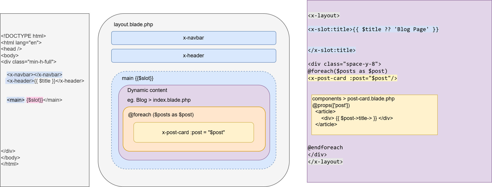
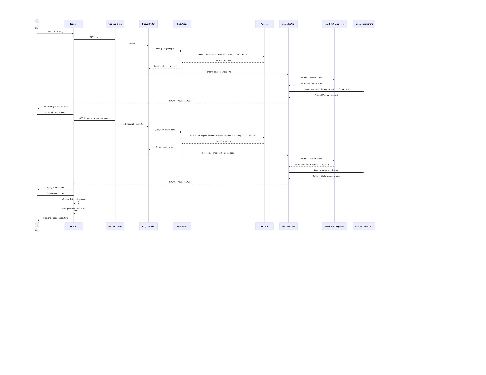

# Blog Application

A simple blog application built with Laravel and TailwindCSS.

## Overview

This is a blog platform that allows you to create posts, users with factory method, read, and manage blog posts. 

## Features

- Modern, responsive design using TailwindCSS 4
- Blog post listing with pagination
- Individual blog post views

## Tech Stack

- **Backend**: Laravel 12
- **Frontend**: TailwindCSS 4 
- **Database**: SQLite (default, configurable)
- **Build Tool**: Vite

## Requirements

- PHP >= 8.2
- Composer
- Node.js >= 18
- npm or yarn

## Installation

### Step 1: Clone the repository

```bash
git clone https://github.com/yourusername/blog-app.git
cd blog-app
```

### Step 2: Install dependencies

```bash
# Install PHP dependencies
composer install

# Install Node.js dependencies
npm install
```

### Step 3: Set up environment

```bash
# Copy the environment file
cp .env.example .env

# Generate application key
php artisan key:generate
```

### Step 4: Create the database

```bash
# Create SQLite database
touch database/database.sqlite

# Run migrations
php artisan migrate

# Seed the database with sample data
php artisan db:seed
```

### Step 5: Start the development server

```bash
# Start Laravel server and Vite development server
npm run dev
```

In a separate terminal window:

```bash
# Start the PHP server
php artisan serve
```

Now you can access the application at http://localhost:8000
Or you can install laravel Herd https://herd.laravel.com/

### Using the dev command

The project includes a convenient `dev` command that starts all necessary services:

```bash
composer run dev
```

This will run the Laravel development server, queue worker, and Vite development server simultaneously.

## Configuration

### Database Configuration

The application is configured to use SQLite by default, but you can change this in the `.env` file:

```
DB_CONNECTION=mysql
DB_HOST=127.0.0.1
DB_PORT=3306
DB_DATABASE=laravel
DB_USERNAME=root
DB_PASSWORD=
```

## License

This project is open-sourced software licensed under the [MIT license](https://opensource.org/licenses/MIT).

## Contributing

Contributions are welcome! Please feel free to submit a Pull Request.

## Credits

- [Laravel](https://laravel.com/)
- [TailwindCSS](https://tailwindcss.com/)
- [Vite](https://vitejs.dev/)

# Laravel Blog CRUD

Understanding how component in Laravel works



On how blog MVC relates with one another



Factory

In Laravel's factory system, the **`$attributes` parameter is not passed via a constructor** because of how the factory pipeline is designed. Here's why:

---

### **1. Dynamic Attribute Resolution**

Factories need to **lazily evaluate attributes** because:

- Some values (like `fake()->email()`) must be generated at runtime.
- Attributes can be **sequentially modified** by multiple `>state()` calls.

### **Example Workflow:**

```
User::factory()
    ->state(['name' => 'Alice'])  // State 1
    ->state(['is_admin' => true]) // State 2
    ->create();
```

Each `state()` call progressively modifies the attributes. A constructor couldn't handle this dynamic merging.

---

### **2. Closures Allow Late Binding**

The `state()` method uses closures to:

- **Preserve the current attributes** at the time of execution.
- **Allow conditional logic** based on existing attributes:
    

    
    ```
    return $this->state(fn (array $attrs) => [
        'email' => $attrs['name'] . '@company.com', // Uses 'name' from previous state
    ]);
    ```
    

---

### **3. Constructor Limitations**

If factories used constructors for attributes:

- **Inflexible**: Would require all attributes upfront.
- **No Chaining**: Couldn’t support fluent `>state()->create()` syntax.
- **Performance Overhead**: Would force eager evaluation of fake data.

---

### **How Laravel Factories Actually Work**

1. **Step 1**: `definition()` sets defaults.
2. **Step 2**: `state()` closures sequentially modify attributes.
3. **Step 3**: `create()`/`make()` finalizes and builds the model.

### **Under the Hood:**

```
// Simplified factory logic
public function state(callable $closure)
{
    $this->states[] = $closure; // Stores closures for later execution
    return $this;
}

public function create()
{
    $attributes = $this->definition(); // Start with defaults
    foreach ($this->states as $closure) {
        $attributes = array_merge($attributes, $closure($attributes)); // Merges states
    }
    return User::create($attributes);
}
```

---

### **Key Advantages Over Constructor-Based Design**

| **Feature** | **Closure-Based (`state()`)** | **Constructor-Based** |
| --- | --- | --- |
| **Dynamic Attributes** | ✅ Late evaluation | ❌ Eager evaluation |
| **Sequential Modifications** | ✅ Supports chaining | ❌ Single-shot |
| **Conditional Logic** | ✅ Access to interim attributes | ❌ No context |
| **Fake Data Generation** | ✅ On-demand (`fake()`) | ❌ Must generate upfront |

---

### **When Would You Use a Constructor?**

Only for **static factory configuration**, not attributes:

```
class UserFactory extends Factory
{
    public function __construct(
        protected bool $isAdmin = false // Config flag, NOT user attributes
    ) {
        parent::__construct();
    }

    public function definition()
    {
        return [
            'is_admin' => $this->isAdmin, // Passes config to attributes
        ];
    }
}

// Usage
User::factory(isAdmin: true)->create();
```

---

### **Summary**

Laravel factories avoid constructors for attributes because:

1. **Flexibility**: Closures allow dynamic, sequential changes.
2. **Performance**: Delays fake data generation until needed.
3. **Clarity**: Explicit `state()` calls are more readable than constructor params.

### **What is a Closure in PHP?**

A **closure** is an anonymous function (a function without a name) that can:

1. **Capture variables** from its surrounding scope (even after that scope has exited).
2. **Be passed as an argument** to other functions/methods.
3. **Be stored in variables** or executed later.

---

### **Key Features of Closures**

| **Feature** | **Description** |
| --- | --- |
| **Anonymous** | Has no function name (e.g., `function () { ... }`). |
| **Captures State** | "Remembers" variables from its parent scope (via `use` keyword). |
| **First-Class Citizen** | Can be assigned to variables, passed as arguments, or returned from functions. |

---

### **Example 1: Basic Closure**

```
$greet = function ($name) {
    return "Hello, $name!";
};

echo $greet("Alice"); // Output: "Hello, Alice!"
```

---

### **Example 2: Capturing Variables (with `use`)**

```
$prefix = "Mr. ";
$greet = function ($name) use ($prefix) {
    return "$prefix$name";
};

echo $greet("Smith"); // Output: "Mr. Smith"
```

- The `use ($prefix)` allows the closure to "remember" `$prefix` even if it goes out of scope.

---

### **Why Closures Matter in Laravel Factories**

In Laravel factories, closures are used in `state()` to **dynamically modify attributes**:

```
public function isAdmin(): static
{
    return $this->state(function (array $attributes) {
        return ['is_admin' => true]; // Merges with existing $attributes
    });
}
```

Here, the closure:

1. Takes the current `$attributes` as input.
2. Returns new attributes to merge.
3. **Preserves the factory's fluent chaining** (e.g., `>state()->create()`).

---

### **Closures vs. Regular Functions**

| **Feature** | **Closure** | **Regular Function** |
| --- | --- | --- |
| **Name** | Anonymous | Named (e.g., `foo()`) |
| **Scope Capture** | Yes (via `use`) | No |
| **Usage in Laravel** | Factory states, route definitions | Global/class methods |

---

### **Practical Laravel Examples**

### 1. **Factory State (Dynamic Attributes)**

```
User::factory()->state(function (array $attrs) {
    return ['email' => strtolower($attrs['name']) . '@test.com'];
})->create();
```


### 2. **Route Definitions**

```
Route::get('/user', function () {
    return view('user.profile');
});
```

### 3. **Collection Operations**

```
$users->filter(function ($user) {
    return $user->isAdmin();
});
```

---

### **Under the Hood: How Closures Work**

1. **PHP creates a `Closure` object** behind the scenes.
2. **Captured variables** are stored in the closure's scope.
3. **Executed later** (e.g., when `create()` is called in factories).

---

### **When to Use Closures**

- **Short-lived logic** (e.g., factory states, route handlers).
- **Capturing context** (e.g., loop variables, service containers).
- **Functional programming patterns** (e.g., `array_map`, `filter`).

---

### **Summary**

- A closure is an **anonymous function + captured scope**.
- Laravel uses them extensively for **flexible, deferred execution** (factories, routes).
- They enable **clean, expressive code** without polluting the global namespace.

Database migration Eloquent Relationship

### [**Foreign Key Constraints**](https://laravel.com/docs/12.x/migrations#foreign-key-constraints)

Laravel also provides support for creating foreign key constraints, which are used to force referential integrity at the database level. For example, let's define a **`user_id`** column on the **`posts`** table that references the **`id`** column on a **`users`** table:

```jsx
use Illuminate\Database\Schema\Blueprint;
use Illuminate\Support\Facades\Schema;

Schema::table('posts', function (Blueprint $table) {
    $table->unsignedBigInteger('user_id');

    $table->foreign('user_id')->references('id')->on('users');
});
```
